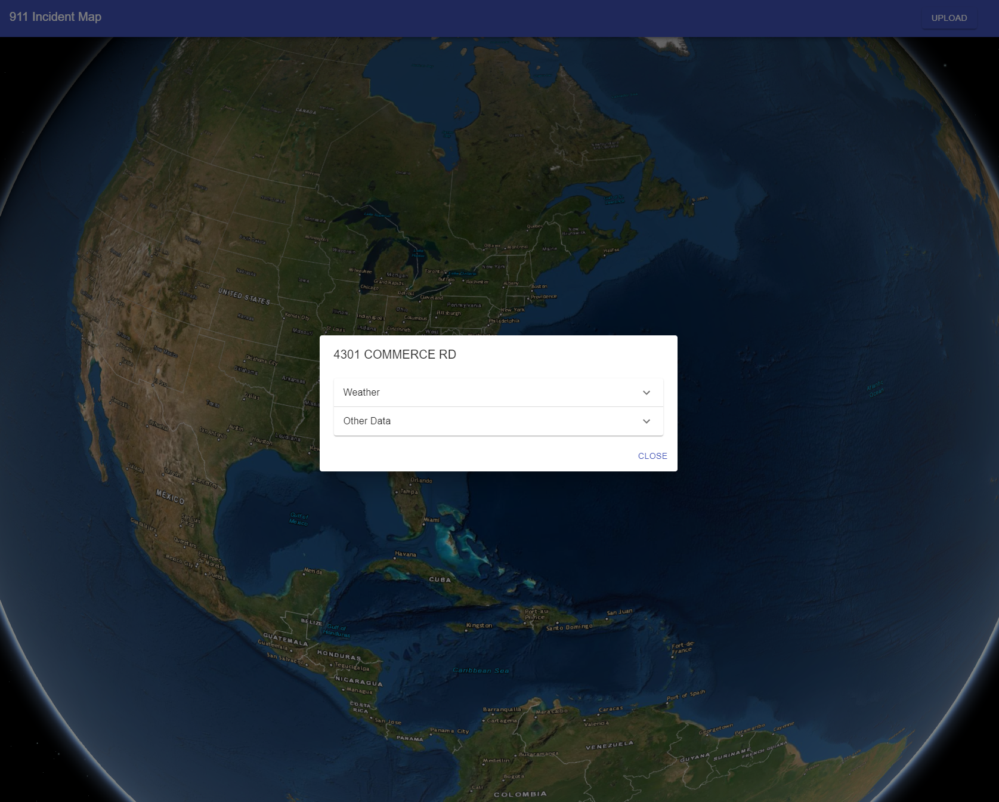
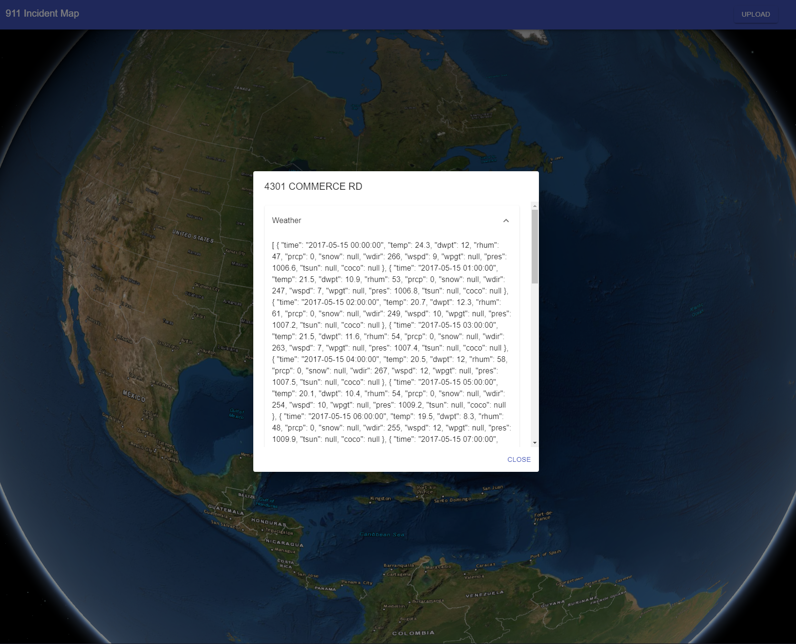

911 Incident Map

Task
----
Given an incident data, enrich it and then display the location and data on a map for easy validation. Try to utilize best practices where possible given available time. 

Steps to install
-----------
* Clone the repo and run `npm install` inside the directory
* Run `npm run start` to start the local server
* Open that app at `localhost:3000`

Improvments
-----------
* I'd would like to have spent more time making a true full stack application. With this approach I mainly wanted to get the web client portion done. I would have wanted to get a database running to store each incident report and uploader new reports. Right now, my approach only simulates uploading a new report

* I would have also like to flesh out the components a little more. Specifically the dialog when you click on a marker. Right now it just prints out the json in an ugly fashion. 

* Spent ~ 3 hours completing this.

Screenshots
-----------

